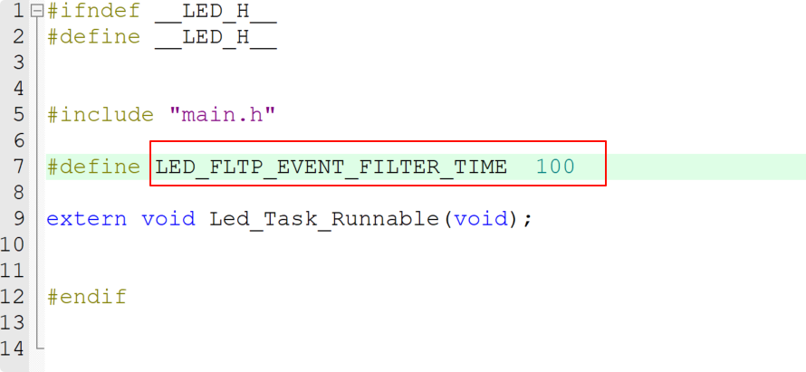

# 06_基于 Cubemx 实现按键控制 LED 灯

## 实验目的

1. 检验基于 Cubemx 搭建 STM32 裸机开发的能力
2. 理解按键的电路原理
3. 理解 LED 灯的电路原理

## 实验内容

1. 用 STM32CubeMX 实现基于 STM32F411CEU6 开发板（WeAct Studio）（**若没有此开发板也可以先用自己身边的开发板**）的按键控制 LED 灯闪烁的工程。
2. 将本次作业上传 git 分支为：LED_Initial

## 实验过程

### LED的电路原理


根据原理图可知，当PC13为低电平时电路导通，LED发光，PD13为高电平时电路无法导通，LED熄灭。

### 按键的电路原理


根据原理图可知，当按键按下时电路导通，当按键松开时电路断开。

### 工程创建

使用STM32CubeMX快捷创建开发工程，需要配置的有

- [x] 时钟配置

​	使用外部高速晶振和外部低速晶振


- [x] LED灯IO配置

    将IO设置为推完输出默认高电平，默认不上拉也不下拉

    

- [x] KEY按键IO配置

​	将按键IO配合为输入模式，并且开启上拉电阻，使得IO默认为高电平


- [ ] 项目生成

​	注意勾选


按照步骤即可生成项目


### 代码编写

创建对应的驱动文件LED.C LED.H KEY.C KEY.h


添加对应头文件路径


然后写入代码

LED.h

```c
#ifndef __LED_H__
#define	__LED_H__


#include "main.h"

#define LED_FLTP_EVENT_FILTER_TIME	100

extern void Led_Task_Runnable(void);


#endif


```

LED.c

```c
#include "LED.h"

static uint8_t Led_init(void)
{
	return 0;
}

static void Led_Toggle(void)
{
	HAL_GPIO_TogglePin(LED_GPIO_Port,LED_Pin);
}

void Led_Task_Runnable(void)
{
	static uint8_t task_state;
	static uint32_t key_press_cnt = 0;
	static uint8_t cnt_state = 0;
	if(task_state == 0)
	{
		if(Led_init() == 0)
		{
			task_state = 1;
		}
	}else{
		if(g_E_key_state == KEY_PRESSED )
		{
			cnt_state = 1;
		}else
		{
			cnt_state = 0;
		}
		if(cnt_state == 1)
		{
			key_press_cnt++;
		}else{
			if(key_press_cnt >= LED_FLTP_EVENT_FILTER_TIME)
			{
				Led_Toggle();
			}
			key_press_cnt = 0;
		}
	}
}


```

Key.h

```c
#ifndef __KEY_H__
#define	__KEY_H__


#include "main.h"


#define	KEY_FILTER_TIME	10

typedef enum{
	KEY_RELEASED=0,
	KEY_PRESSED
}KeyState;

extern uint8_t g_E_key_state;
extern void Key_Task_Runnable(void);

#endif


```

Key.c

```c
#include"Key.h"

uint8_t g_E_key_state = KEY_RELEASED;

static uint8_t Key_init(void)
{
	return 0;
}

static uint8_t Key_GetState(void)
{
	if(HAL_GPIO_ReadPin(KEY_GPIO_Port,KEY_Pin) == 1)
	{
		return 1;
	}else{
		return 0;
	}
}

void Key_Task_Runnable(void)
{
	static uint8_t task_state = 0;
	uint8_t pin_state = GPIO_PIN_RESET;
	if(task_state == 0)
	{
		if(Key_init()==0)
		{
			task_state = 1;
		}
	}else{
		pin_state = Key_GetState();
		if(pin_state == 0)
		{
			if(g_E_key_state == KEY_RELEASED )
			{
				HAL_Delay(KEY_FILTER_TIME);
				pin_state = Key_GetState();
				if(pin_state == 0)
				{
					g_E_key_state = KEY_PRESSED;
				}else{
					g_E_key_state = KEY_RELEASED;
				}
			}
		}else{
			g_E_key_state = KEY_RELEASED;
		}
	}
}


```

根据教程的思路，通常在代码空间足够的时候可以将代码整体封装，使用面向对象的思想去编写代码，使得代码书写思路更清晰，以及后续使用更加方便

## 实验结果

成功点亮LED小灯，并在每次按下按键后，LED等状态反转

通过调节



可以发现当LED_FLTP_EVENT_FILTER_TIME调整为一个较大的数值时，连续点击按键LED翻转并不会生效