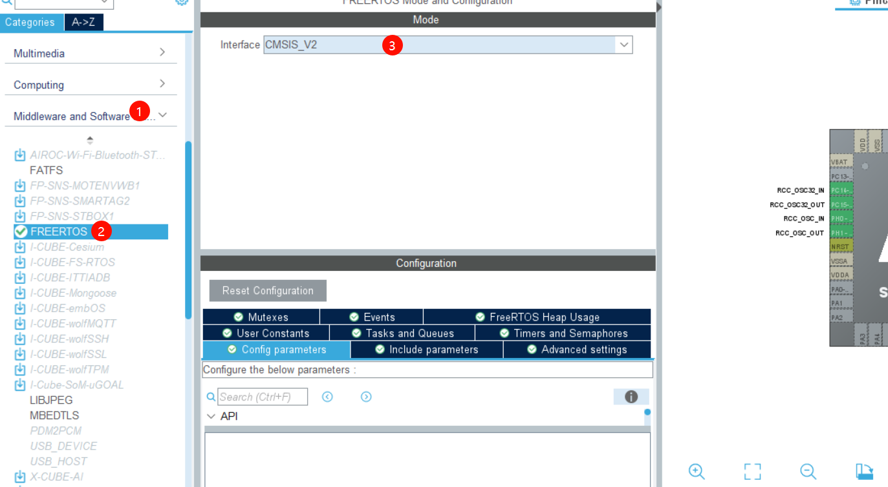
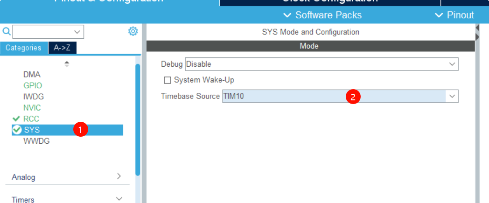
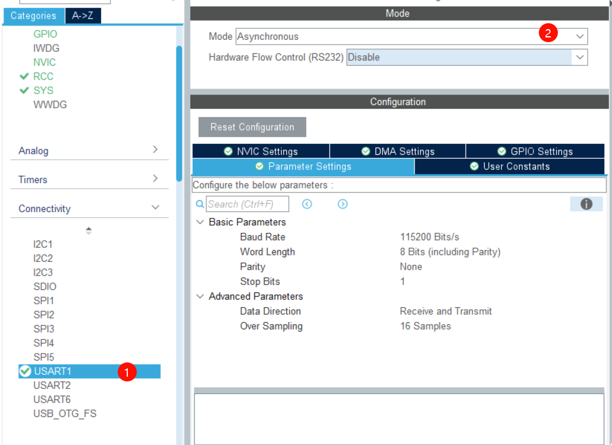
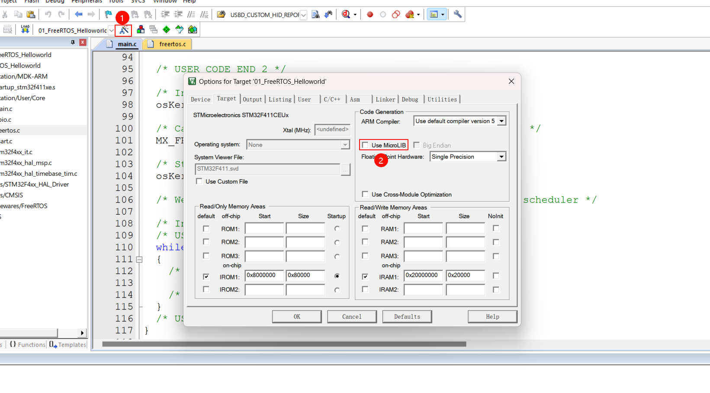
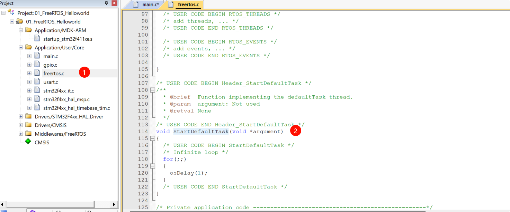
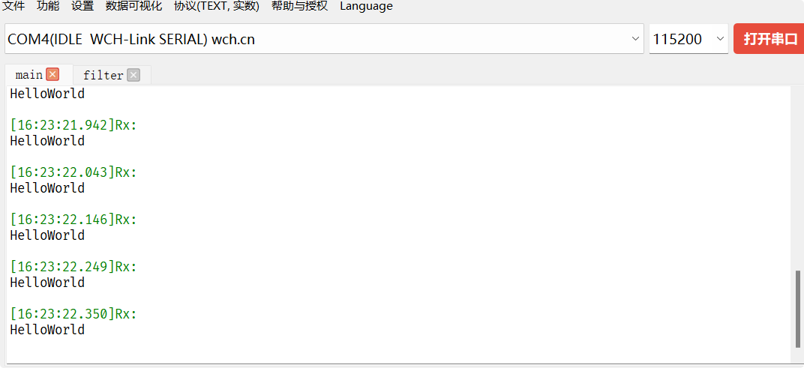
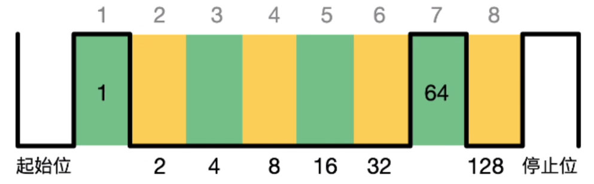

# 07_STM32 的基于 Cubemx 的 FreeRTOS 的 helloworld 输出的工程 & Git 的使用

## 学习目标

1. 检验基于 Cubemx 搭建 STM32 的 FreeRTOS 的开发环境的能力
2. 建立 Git 仓库，并设置为公开仓库，方便后续检查作业
3. 理解什么是串口通信
4. 理解什么是 TTL 电平
5. 理解电脑和单片机进行通信为什么要用 USB 转 TTL

## 实验内容

用 STM32CubeMX 实现基于 STM32F411CEU6 开发板（WeAct Studio）的串口（PA9|PA10）在 default 任务中输出 Hellow word 的工程。

## 实验过程

### 工程创建

使用STM32CubeMX完成最基本的时钟配置



然后按照上图中配置完成FreeRTOS的配置

接着将Timebase Source切换为其他定时器



接着配置USART1引脚



最后生产项目，并开始编写代码

### Printf重定向

完成上述步骤后，开始实现串口重定向，首先打开Options for Target,勾选Use MicroLIB



接着引入“stdio.h”头文件，并写入重定向代码

```c
int fputc(int ch,FILE *f)
{
    HAL_UART_Transmit(&huart1,(uint8_t *)&ch,1,100);
	return ch;
}
```

### 输出HelloWorld测试printf重定向是否成功

按照实验要求，在default 任务中定时输出hello world，首先找到default 任务



写入如下代码

```c
void StartDefaultTask(void *argument)
{
  /* USER CODE BEGIN StartDefaultTask */
  /* Infinite loop */
  for(;;)
  {
	printf("HelloWorld\r\n");
	osDelay(100);
  }
  /* USER CODE END StartDefaultTask */
}
```

要注意的是，使用printf需要引入"stdio.h",为了减少添加头文件次数，我们可以将头文件添加在main.h中这样在freertos.c中就不需要重复引用了

## 实验结果

按照上述操作后，编译程序，后烧录进开发板，并且打开串口助手可以看到一下现象



可以看到串口正常收到数据，并且发送间为0.1S左右，实验完成

## 本节面试问题

### 为什么时钟源配置时，要用另一个定时器作为系统时钟？

答：CubeMX的Timebase Source配置是指HAL_Delay()、HAL库相关的时间基准，默认是用Systick来作为时间基准，但是在RTOS操作系统中默认使用了Systick作为时间片基准，这样的话，原有的Timebase Source就需要使用其他的定时器作为时间基准。

### 串口通信时的 GND 是否一定要接？VCC 是否一定要接？

答：GND是必须要接的，VCC并不是必须的，通常情况下串口通讯只需要连接GND、TX、RX即可，GND是作为公共参考电位，作为共同电压的基准，TX、RX则是用来数据的发送和接受。

### 什么是 printf 的重定向？

答：首先printf函数是C语言中最常用的标准输出函数，通常在<stdio.h>中，printf重定向就是将printf移植到嵌入式平台上使用，这样的话，使得我们在嵌入式开发中可以更方便高效的输出。

### 串口是否有起始位？如果有，是怎么样的？

答：串口是有起始位的，通常情况下串口通讯的起始位是1位，通常是下拉1/波特率的时间作为起始位。



### 【拓展】什么是 git stash， 什么时候会使用 git stash？ git stash pop?

答：

`git stash`命令能够将当前工作目录中尚未提交的所有更改（包括暂存区和未暂存的修改）临时存储到stash堆栈中，从而让用户在不影响当前工作进度的前提下，轻松切换到其他分支处理问题、合并代码或恢复到干净的工作状态

`git stash pop` 命令用于应用最近一次保存的缓存，并从缓存列表中移除它。当我们完成其他任务后，可以通过 `git stash pop` 将之前的工作进度恢复到当前分支。

什么使用使用：当我们在分支改代码，改一半发现想要临时存储起来，做其他的事情，等做完其他的事情后，再重新把之前改了一半的修改还原回来。这个时候可以通过`git stash`和`git stash pop`操作。

