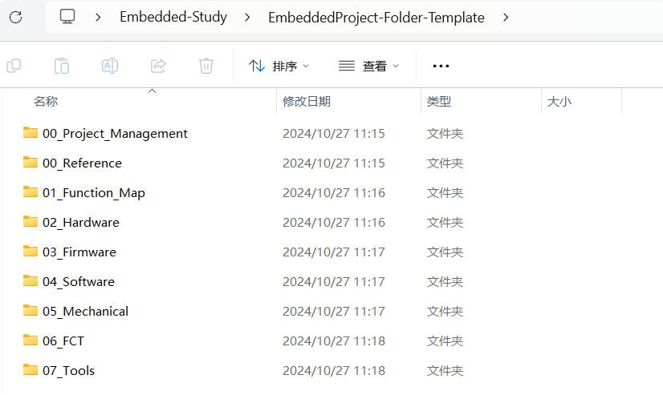

# 01_大厂开始一个项目的流程与文件夹创建

## 学习目标

[飞书-01 大厂开始一个项目的流程与文件夹创建](https://twd6onxsxva.feishu.cn/docx/J9cjduDK9o1mruxNorDcyWxgn4g)

## 实验内容

- [x] 构建自己的文件夹目录，并上传到Git,作为你的base仓库，以后的作业都是在这个仓库进行

​	答：[YIGE-ONEG/Embedded-Study](https://github.com/YIGE-ONEG/Embedded-Study)

- [x] 了解和熟悉敏捷开发、瀑布开发这两种开发模式
- [x] 创建自己的项目开发模板



创建了如图的项目模板其中

```
├─00_Project_Management			# 开发前的文档
│  ├─00_需求导入_QFD
│  ├─01_需求约束_Pugh
│  ├─02_需求转化_Basic_Statics
│  ├─03_功能图谱_Function_Map
│  ├─04_功能风险管控_DFMEA
│  ├─04_法规认证_国内_国外
│  ├─04_知识产权_国内_国外
│  ├─05_敏捷开发_Scrum
│  ├─06_持续集成与测试_DevOps
│  ├─07_产品生产管理_Six_Sigma
│  └─08_缺陷管理追踪_Jira
├─00_Reference					#参考文档
├─01_Function_Map				#功能具体需求清单、流程图...
├─02_Hardware					#硬件相关：原理图、PCB
│  ├─00_Ref
│  │  └─00_HDK					#Hardware Develop Toolkit
│  └─01_Project
├─03_Firmware					#放置版本.hex/.bin固件
├─04_Software					#软件代码
│  ├─00_Ref						
│  │  └─00_SDK					#Software Develop Toolkit
|  |  └─....
│  └─01_Source_Code
├─05_Mechanical					#机械结构部分..
├─06_FCT						#产品发布后的上位机工具..
└─07_Tools						#开发过程中用到的工具..
....
```


## 面试问题准备

1. 敏捷开发和瀑布开发的区别？各自的优势是什么？

​	答：**瀑布开发**：采用线性开发，按照预先的规划的顺序的依次进行需求分析 、设计、编码、测试等环节。每个环节都需要上一个环节完成才能进入下一个环节。瀑布开发的优点是开发流程规范、文档丰富、分工明确、便于后期维护。适用于大型软件开发

​	**敏捷开发**：旨在构建完成最小发布版本后完成测试即可释放，后续以迭代的方式发布软件，起优势在于能快速流入市场，经受市场的考验便于企业调整策略，短周期迭代可以持续提快生产价值，同时频繁测试与集成可以及时发现问题

